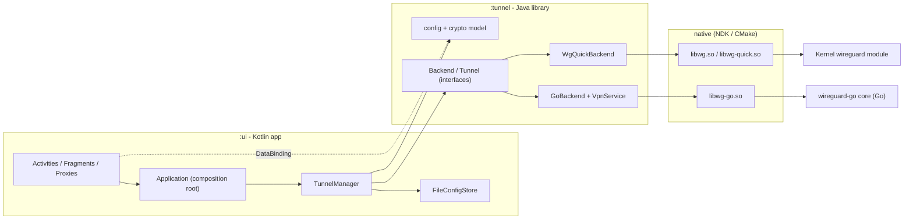
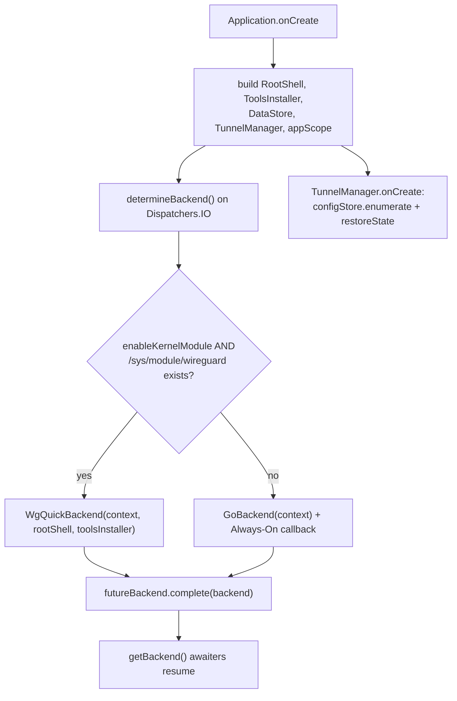
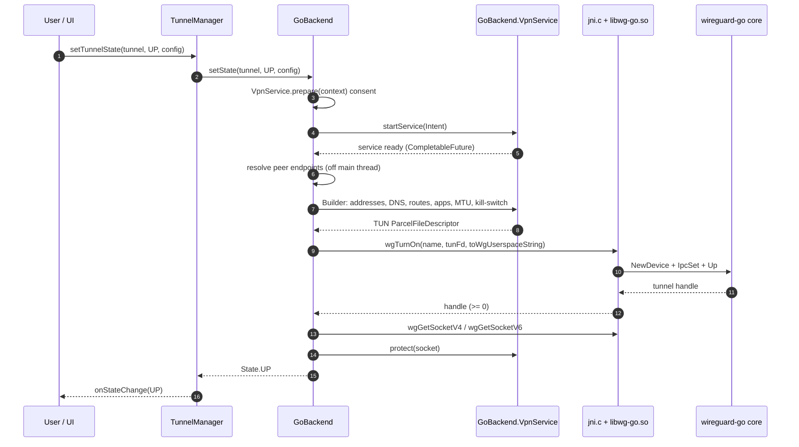
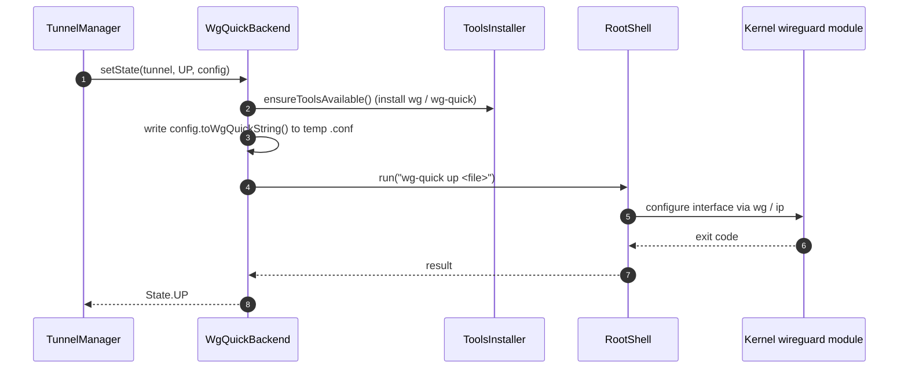
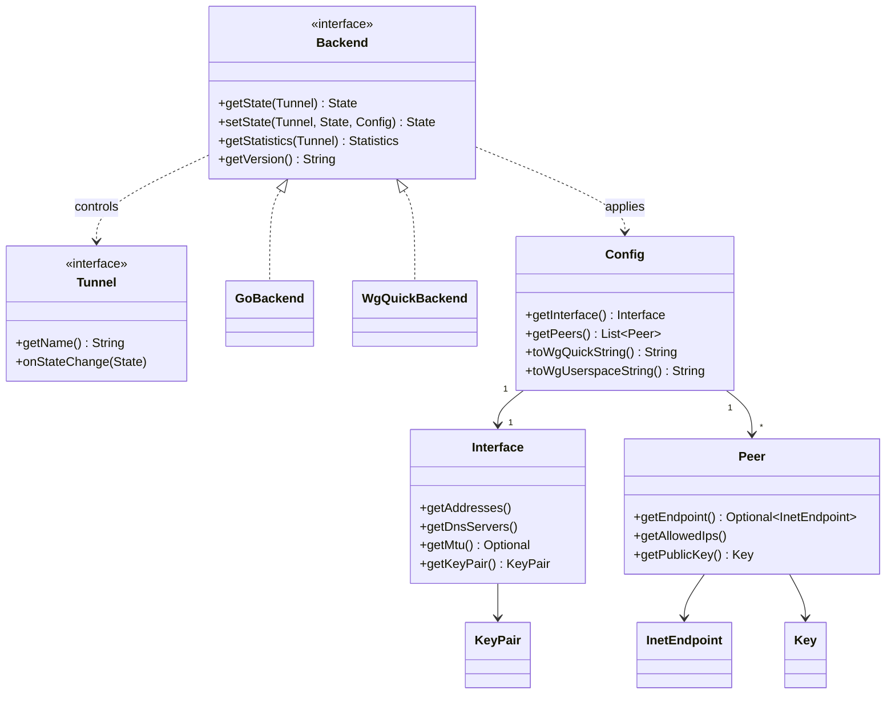
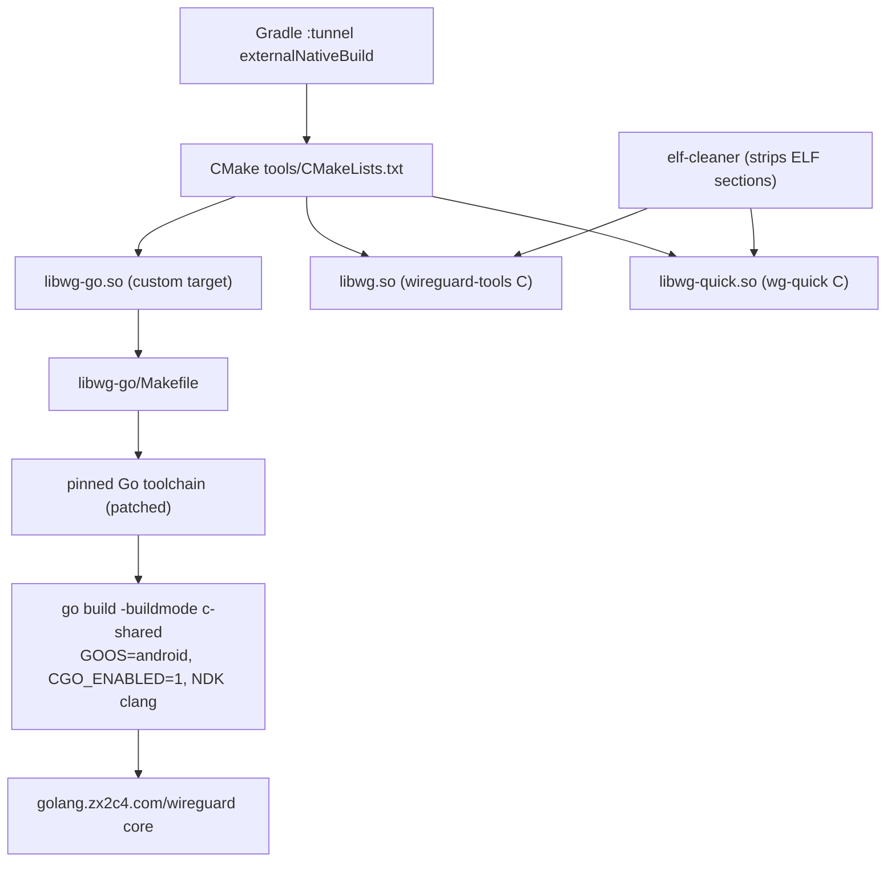
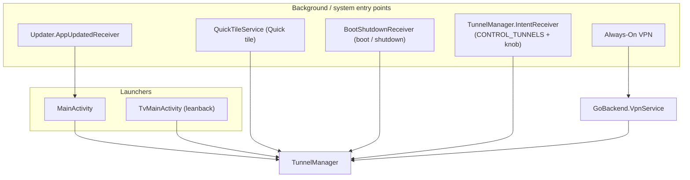
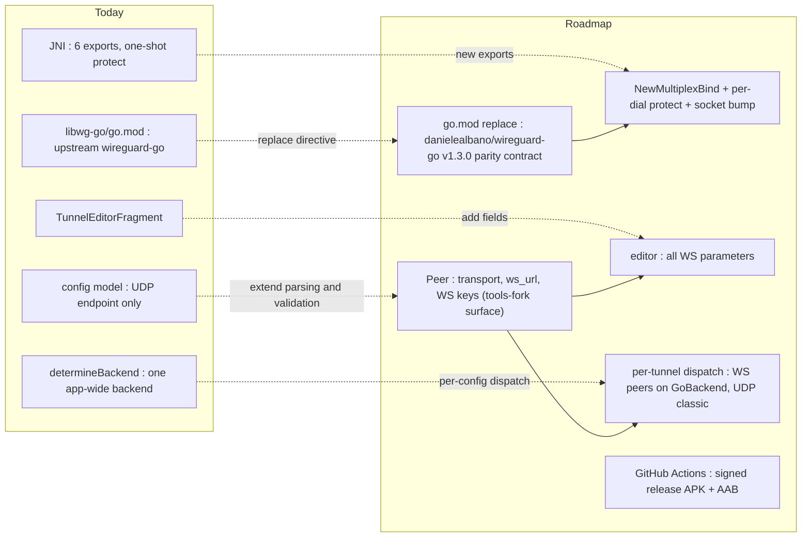

# wireguard-android — Architecture

This document describes how wireguard-android is structured and how a tunnel is configured, brought
up, and torn down. Read `docs/PROJECT.md` first for the high-level overview, tech stack, and module
layout.

The app is split into two Gradle modules plus a native layer:

- **`:ui`** — the Kotlin application. Its `Application` is the composition root; `TunnelManager`
  owns tunnel state; `FileConfigStore` persists configs; activities/fragments render them through
  DataBinding and editable view-model proxies.
- **`:tunnel`** — the reusable Java library. It owns the immutable **config/crypto model** and the
  **`Backend` abstraction** with two implementations (`GoBackend`, `WgQuickBackend`).
- **native** — `libwg-go.so` (the `wireguard-go` userspace core via a cgo/JNI shim) and
  `libwg.so` / `libwg-quick.so` (the `wireguard-tools` C utilities), built by CMake + the NDK.

The two boundaries that make this portable and swappable are the **`Backend` interface** (Go
userspace vs. kernel/root) and the **JNI ABI** into `libwg-go.so`.

---

## 1. Module & Dependency Overview

`:ui` depends on `:tunnel`; `:tunnel` owns the backends and the native libraries it loads. Nothing
in `:ui` talks to the native layer directly — it goes through `Backend`.

---

## 2. Application Wiring & Backend Selection

`Application.onCreate()` builds the app-wide singletons and exposes them via companion accessors
(a service-locator pattern; there is no DI framework). The backend is resolved off the main thread
and published through a `CompletableDeferred`, so `getBackend()` suspends until it is ready.

`TunnelManager` keeps tunnels in an observable, sorted, key-unique list
(`ObservableSortedKeyedArrayList`), tracks `lastUsedTunnel`, and hops between `Dispatchers.IO`
(store/backend calls) and
`Dispatchers.Main.immediate` (observable state). CRUD and toggles roll back on failure.

---

## 3. Tunnel Bring-up — GoBackend (userspace, no root)

The default path. `GoBackend` obtains VPN consent, builds the Android `VpnService` interface, then
hands the TUN file descriptor and the UAPI config string to `libwg-go.so` over JNI, and protects the
underlying UDP sockets so tunnel traffic does not route back into itself.

Tear-down calls `wgTurnOff(handle)` and stops the service. `getStatistics()` calls `wgGetConfig` and
parses the UAPI `rx_bytes`/`tx_bytes`/`last_handshake_time_*` lines per peer.

---

## 4. Tunnel Bring-up — WgQuickBackend (kernel module, root)

Used only when the kernel-module knob is enabled and `/sys/module/wireguard` exists. The config is
written to a temporary `.conf` and applied with `wg-quick` through a root shell; the bundled C tools
are installed on demand.

Statistics come from parsing `wg show <iface> dump`. Bringing one tunnel up first brings the others
down unless multi-tunnel mode is enabled.

---

## 5. Configuration Data Model

The config model lives in `:tunnel` and is externally immutable (built via `Builder`s). It serializes
to two forms: `toWgQuickString()` (kernel backend + export) and `toWgUserspaceString()` (the UAPI form
the Go backend feeds to `libwg-go`).

In `:ui`, the editable UI never mutates these types directly — it edits `ConfigProxy` /
`InterfaceProxy` / `PeerProxy` (observable, `Parcelable` wrappers) and calls `resolve()` to rebuild an
immutable `Config`. `FileConfigStore` persists each tunnel as `<name>.conf` in internal storage.

---

## 6. Native Build Toolchain

The native libraries are produced as part of the Gradle build via `externalNativeBuild` (CMake). The
Go library is cross-compiled by its own `Makefile` (invoked from CMake) using a pinned, runtime-patched
Go toolchain and the NDK clang as the cgo compiler.

The `release` vs `debug` variants pass a different `ANDROID_PACKAGE_NAME` into CMake (so paths carry
the `.debug` suffix). All three `.so` files are built for every Android ABI.

---

## 7. Android Entry Points

Beyond the launcher activities, several platform surfaces can drive `TunnelManager` / the VPN. The
remote-control receiver is guarded by the custom `CONTROL_TUNNELS` permission and a runtime knob.

Settings and state persist through **Preferences DataStore** (`UserKnobs`); managed-device policy
(`disable_config_export`) comes from `AdminKnobs`. Import flows (`TunnelImporter`, QR) and export
(`ZipExporterPreference`) funnel through `TunnelManager` and the config model.

---

## 8. Roadmap Integration Points

The planned extensions (see `docs/PROJECT.md` → Roadmap) attach to the existing boundaries, but the
WebSocket work **extends two of them**: the JNI contract gains new exports (per-dial protect
callback, socket bump) and the config model gains the per-peer transport surface. The
`VpnService` establishment flow and the UDP data path are unchanged.

- **Backend switch** is a `go.mod` `replace` directive to `danielealbano/wireguard-go` (module path
  unchanged; commit-pinned until the `v1.3.0` tag exists) **plus new JNI surface**: the shim
  constructs `conn.NewMultiplexBind` (UDP + WebSocket in one bind), bridges a Go→Java per-dial
  `VpnService.protect(fd)` upcall (`conn.WithWSProtect`), and adds a socket-bump export wrapping
  `device.BindUpdate()` driven by a `ConnectivityManager` network callback. The six existing
  exports remain; `wgGetSocketV4/V6` keep protecting the UDP sub-bind.
- **WebSocket/wstunnel config + UI** adds the per-peer transport surface to the config model —
  `Endpoint = ws(s)://…` + `WSMode` + the `WS*` keys, byte-compatible with the sibling
  `wireguard-tools` fork, with the same inference/validation. `InetEndpoint` keeps requiring
  `host:port` (it carries the routable, DNS-pre-resolved `endpoint=ip:port`); the URL travels
  separately as `ws_url`. The editor exposes every parameter (file selector for TLS paths).
- **Per-tunnel backend dispatch**: a config with any websocket/wstunnel peer always runs on
  `GoBackend`; pure-UDP configs keep the classic kernel-vs-userspace selection; `WgQuickBackend`
  fails fast on a WS config.
- **CI + signing** is additive build/tooling (a signed release variant + a GitHub Actions workflow +
  a root Makefile), with no change to app behavior.
